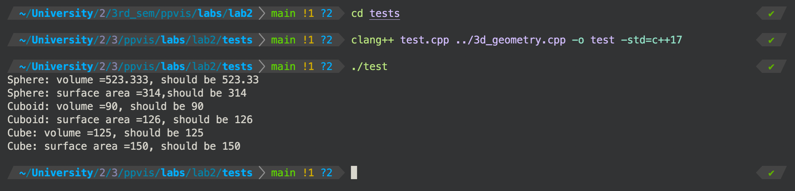

Second lab, third semester. ППвИС. [Full task description](description/task.md)

TL;DR This is a simple C++ app that implements a hierarchy of 3-dimensional geometric figures. The main goal of this assignment was to understand how mechanisms of inheritance and namespacing work in C++. 

The example of compiling and running the program (test is done using the [catch2](https://github.com/catchorg/Catch2) library):
