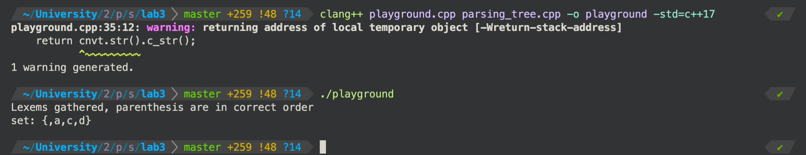

Third lab, third semester. ППвИС. [Full task description](description/task.md)

TL;DR It's a calculator for mathematical set exressions that uses eBNF notation for syntax (library used: [bnflite](https://github.com/r35382/bnflite)) and a mechanism similar to Reverse Polish Notation to reconstruct the expression tree from the input string. The task is not fully implemented, custom set operations and shell (or tests) are missing, but it is (probably) a solid basis to implement a feature-rich calculator that works with set expressions.

The example of compiling and running the program (the input is defined in the [playground.cpp](playground.cpp) file):
